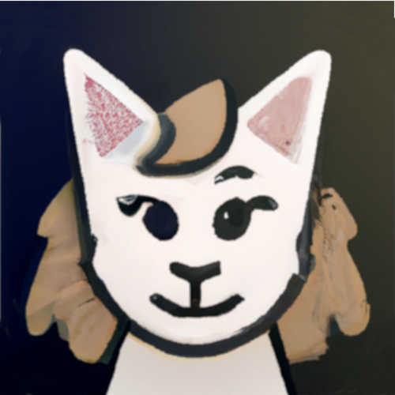
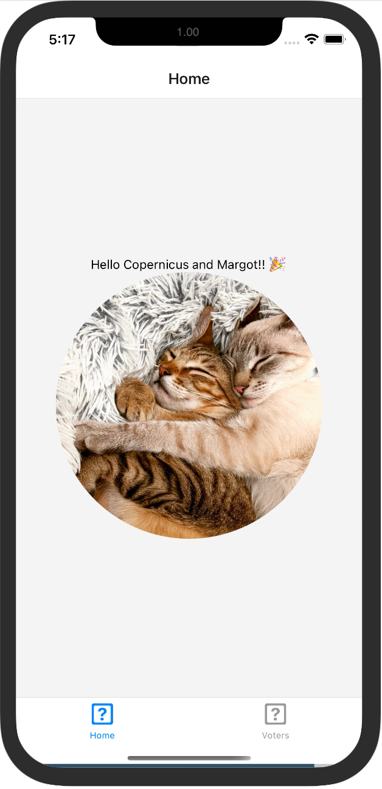

# Cat StoryAI App

|||
| ------------- | ------------- |
 | The word needs more positivity, and the internet already had infinite room for cat content. This app uses ChatGPT and DALL-E 2 to generate content, based on some descriptions of Margot and Copernicus (my cats), and will soon feature custom (your) cats! | 

### Demo and Screenshots
| Preview  | Story List | Story Detail |  About |
| ------------- | ------------- | ------------- |  ------------- 
 |  |  | |

#### The Library

##### Local Storage

The Library is a json of Story entries, which are seeded by the initial storyAssets.json and saved to expo local app storage in documentDirectory. The story entry data model is shown roughly below, and typically loaded into memory for display operations.

    [
      {
        "name": "string: the name of the story",
        "id": "int: unique id, increasing",
        "description": "string: the story content",
        "image": "string: the image url",
        "storyInput": "string: the story ai prompt",
        "imageInput": "string: the image ai prompt",
        "hiddenInput": "string: style prompt appended to impage input",
        "cdn": "boolean: typically false, we store images locally",
      },
     ]

During image creation, we get a URL of the file generated from OpenAI (remotely). We then display the CachedImage component, which saves the file to local (phone) storage and later retrieves it through a local uri. Even though the original image url will no longer be available (from openAI), we will have a local copy.

#### Early Dev:

Expo code for multi-tab navigation app. Used this to teach a quick tutorial for newbies using Expo, then extended the app to something more fun.

| Initial App  | Adding Content | Adding Nav Stack |  UI Fun |
| ------------- | ------------- | ------------- |  ------------- |
|   |   |  | 
| Getting the basics sorted out  | Fixed bottom tab icons  | Home stack, Zoom feature | Material Tab bar and Linear gradient |
