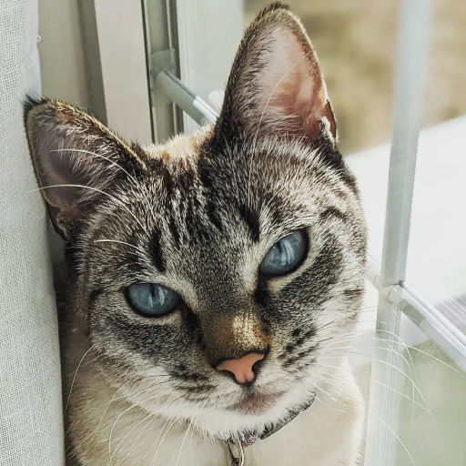

# Training Data for Models

## Margot (the) Model

 |  |  |  |  |  | 

### Notes
Started with regular images, ran into memory issues in Dreambooth. 
Then went to smaller but irregular. Still had issues.
Then trying 512x512.
